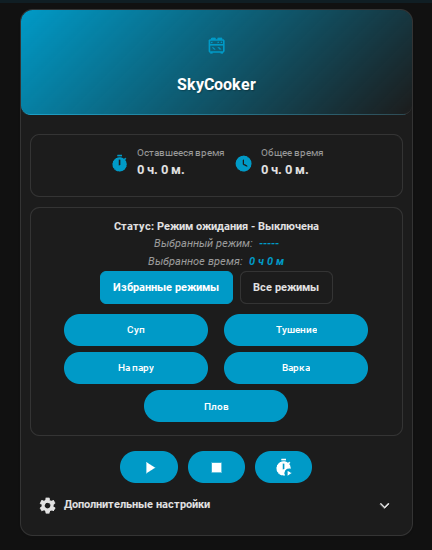
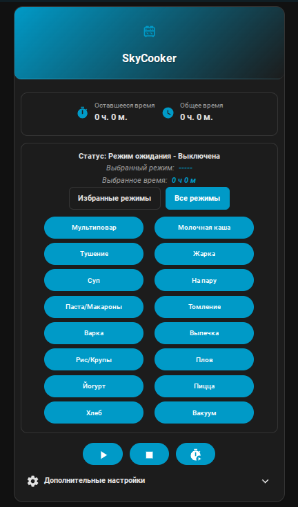
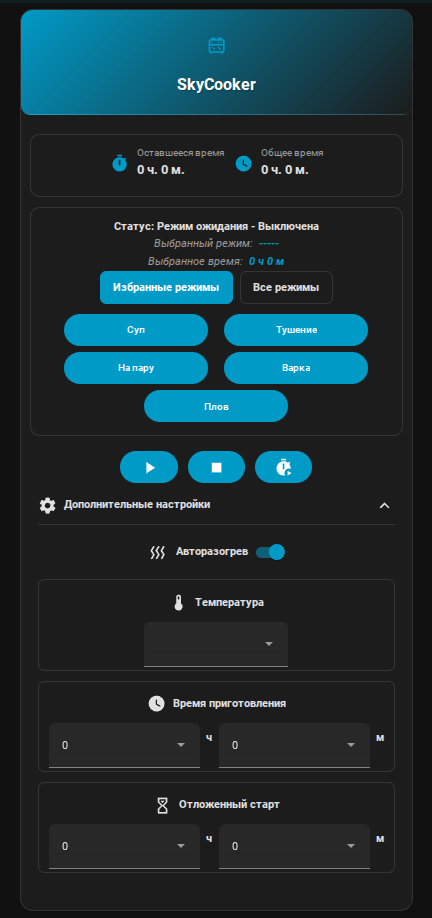

# SkyCooker Card

**Карточка для управления мультиваркой SkyCooker в Home Assistant**

## Описание

Эта карточка предоставляет удобный интерфейс для управления мультиваркой SkyCooker через Home Assistant. Карточка поддерживает два варианта внешнего вида: классический и новый компактный дизайн, вдохновленный lovelace-mushroom.

## Возможности

- **Управление режимами работы**: выбор основного и дополнительного режимов
- **Управление временем приготовления**: установка часов и минут
- **Отложенный старт**: настройка времени отложенного запуска
- **Автоподогрев**: управление функцией автоподогрева
- **Контроль состояния**: отображение текущей температуры, оставшегося времени, общего времени и статуса
- **Прогресс приготовления**: визуальное отображение прогресса в виде прогресс-бара
- **Многоязычный интерфейс**: поддержка русского и английского языков
- **Два варианта внешнего вида**: классический и новый компактный дизайн
- **Переключение внешнего вида**: возможность выбора внешнего вида через конфигурацию

## Установка

### Через HACS (рекомендуется)

1. Добавьте этот репозиторий в HACS:
   - Перейдите в HACS > Интеграции
   - Нажмите на три точки в правом верхнем углу
   - Выберите "Пользовательские репозитории"
   - Добавьте `https://github.com/kai-zer-ru/skycooker-ha-card` как репозиторий типа "Lovelace"
   - Нажмите "Добавить"

2. Установите карточку:
   - Перейдите в HACS > Frontend
   - Найдите "SkyCooker Card" и нажмите "Установить"

### Вручную

1. Скачайте последний релиз с GitHub
2. Скопируйте файл `skycooker-ha-card.js` из папки `dist` в директорию `www` вашего Home Assistant
3. Добавьте карточку в ваши ресурсы:
   ```yaml
   resources:
     - url: /local/skycooker-ha-card.js
       type: module
   ```

## Конфигурация

Минимальная конфигурация карточки:

```yaml
type: custom:skycooker-ha-card
name: SkyCooker
icon: mdi:stove
language: ru
```

Полная конфигурация с всеми параметрами:

```yaml
type: custom:skycooker-ha-card
name: SkyCooker
icon: mdi:stove
language: ru
mode_entity: select.skycooker_mode
additional_mode_entity: select.skycooker_additional_mode
cooking_time_hours_entity: select.skycooker_cooking_time_hours
cooking_time_minutes_entity: select.skycooker_cooking_time_minutes
delayed_start_hours_entity: select.skycooker_delayed_start_hours
delayed_start_minutes_entity: select.skycooker_delayed_start_minutes
auto_warm_entity: switch.skycooker_auto_warm
start_entity: button.skycooker_start
stop_entity: button.skycooker_stop
start_delayed_entity: button.skycooker_start_delayed
temperature_entity: sensor.skycooker_temperature
remaining_time_entity: sensor.skycooker_remaining_time
total_time_entity: sensor.skycooker_total_time
status_entity: sensor.skycooker_status
current_mode_entity: sensor.skycooker_current_mode
current_additional_mode_entity: sensor.skycooker_current_additional_mode
auto_warm_time_entity: sensor.skycooker_auto_warm_time
delayed_launch_time_entity: sensor.skycooker_delayed_launch_time
```

## Параметры конфигурации

| Параметр | Тип | Обязательно | Описание |
|----------|-----|-------------|-----------|
| type | string | Да | Тип карточки: `custom:skycooker-ha-card` |
| name | string | Нет | Имя карточки (по умолчанию: "SkyCooker") |
| icon | string | Нет | Иконка карточки (по умолчанию: "mdi:stove") |
| language | string | Нет | Язык интерфейса (по умолчанию: "ru") |
| mode_entity | string | Нет | Сущность для выбора режима работы |
| additional_mode_entity | string | Нет | Сущность для выбора дополнительного режима |
| cooking_time_hours_entity | string | Нет | Сущность для выбора часов времени приготовления |
| cooking_time_minutes_entity | string | Нет | Сущность для выбора минут времени приготовления |
| delayed_start_hours_entity | string | Нет | Сущность для выбора часов отложенного старта |
| delayed_start_minutes_entity | string | Нет | Сущность для выбора минут отложенного старта |
| auto_warm_entity | string | Нет | Сущность для управления автоподогревом |
| start_entity | string | Нет | Сущность для кнопки старта |
| stop_entity | string | Нет | Сущность для кнопки остановки |
| start_delayed_entity | string | Нет | Сущность для кнопки отложенного старта |
| temperature_entity | string | Нет | Сущность для отображения температуры |
| remaining_time_entity | string | Нет | Сущность для отображения оставшегося времени |
| total_time_entity | string | Нет | Сущность для отображения общего времени |
| status_entity | string | Нет | Сущность для отображения статуса |
| current_mode_entity | string | Нет | Сущность для отображения текущего режима |
| current_additional_mode_entity | string | Нет | Сущность для отображения текущего дополнительного режима |
| auto_warm_time_entity | string | Нет | Сущность для отображения времени автоподогрева |
| delayed_launch_time_entity | string | Нет | Сущность для отображения времени отложенного старта |
| use_new_design | boolean | Нет | Включить новый компактный внешний вид (по умолчанию: false) |

## Примеры использования

### Минимальная конфигурация

```yaml
type: custom:skycooker-ha-card
name: Моя мультиварка
icon: mdi:pot-mixer
language: ru
mode_entity: select.skycooker_mode
start_entity: button.skycooker_start
stop_entity: button.skycooker_stop
temperature_entity: sensor.skycooker_temperature
```

### Полная конфигурация

```yaml
type: custom:skycooker-ha-card
name: SkyCooker Pro
icon: mdi:stove
temperature_entity: sensor.skycooker_temperature
remaining_time_entity: sensor.skycooker_remaining_time
total_time_entity: sensor.skycooker_total_time
status_entity: sensor.skycooker_status
current_mode_entity: sensor.skycooker_current_mode
mode_entity: select.skycooker_mode
additional_mode_entity: select.skycooker_additional_mode
cooking_time_hours_entity: select.skycooker_cooking_time_hours
cooking_time_minutes_entity: select.skycooker_cooking_time_minutes
delayed_start_hours_entity: select.skycooker_delayed_start_hours
delayed_start_minutes_entity: select.skycooker_delayed_start_minutes
auto_warm_entity: switch.skycooker_auto_warm
start_entity: button.skycooker_start
stop_entity: button.skycooker_stop
start_delayed_entity: button.skycooker_start_delayed
auto_warm_time_entity: sensor.skycooker_auto_warm_time
delayed_launch_time_entity: sensor.skycooker_delayed_launch_time
```

### Конфигурация с новым внешним видом

```yaml
type: custom:skycooker-ha-card
name: SkyCooker (Новый дизайн)
icon: mdi:stove
use_new_design: true  # Включаем новый компактный внешний вид
temperature_entity: sensor.skycooker_temperature
remaining_time_entity: sensor.skycooker_remaining_time
status_entity: sensor.skycooker_status
mode_entity: select.skycooker_mode
start_entity: button.skycooker_start
stop_entity: button.skycooker_stop
```

### Внешний вид

Современный, компактный дизайн с улучшенной пользовательской опыт, вдохновленный популярным lovelace-mushroom. Особенности:

- **Компактный заголовок**: меньший размер, больше информации
- **Улучшенная визуализация**: прогресс-бар с процентным отображением
- **Компактные элементы управления**: оптимизированное расположение
- **Сворачиваемые дополнительные настройки**: экономия места на экране
- **Круглые кнопки действий**: современный дизайн с эффектами наведения
- **Адаптивная сетка**: лучше подходит для мобильных устройств
- **Улучшенные стили**: современные тени, скругленные углы, градиенты
- **Умный прогресс-бар**: автоматически скрывается для неактивных статусов
- **Сенсоры времени**: отображение времени отложенного старта и автоподогрева
- **Подписи в селектах**: улучшенная доступность и понятность интерфейса
- **Красивые селекты времени**: закругленные углы, компактный размер, тени и плавные переходы для всех селектов

## Скриншоты

### Классический внешний вид (избранные режимы)



### Классический внешний вид (все режимы)



### Расширенный внешний вид



## Устранение неполадок

### Карточка не отображается

1. Проверьте, что файл `skycooker-ha-card.js` находится в правильной директории
2. Убедитесь, что ресурс добавлен в конфигурацию Home Assistant
3. Проверьте, что тип карточки указан правильно: `custom:skycooker-ha-card`
4. Очистите кэш браузера и перезагрузите страницу

### Карточка отображается, но не работает

1. Проверьте, что все указанные сущности существуют в вашей системе Home Assistant
2. Убедитесь, что имена сущностей написаны правильно
3. Проверьте, что сущности доступны и имеют правильные состояния
4. Проверьте логи браузера на наличие ошибок (F12 > Console)

### Сообщение "Не настроено"

Это сообщение появляется, если ни одна сущность не указана в конфигурации. Добавьте хотя бы одну сущность для отображения состояния.

### Проблемы с выбором режимов

Если режимы не выбираются или не отображаются правильно:

1. Откройте консоль браузера (F12 > Console)
2. Проверьте логи, которые начинаются с:
   - "Setting config:" - информация о конфигурации
   - "Mode buttons - Entity ID:" - информация о доступных режимах
   - "Has "На пару" option:" - наличие конкретного режима
   - "Setting mode:" - вызов сервиса для установки режима
3. Убедитесь, что:
   - Сущность `mode_entity` правильно указана в конфигурации
   - Опция "На пару" присутствует в атрибутах сущности `mode_entity`
   - Опция "На пару" не фильтруется (не входит в список: 'Нет', 'Режим ожидания', 'None', 'Standby Mode')
   - Сервис `select.select_option` вызывается с правильными параметрами

### Диагностика через логи

Карточка выводит подробные логи в консоль браузера для диагностики проблем:

- Информация о конфигурации при её установке
- Список всех доступных опций для сущности режима
- Наличие опции "На пару" до и после фильтрации
- Параметры вызова сервиса select.select_option при нажатии на кнопку режима

Для просмотра логов откройте консоль браузера (F12 > Console) и выполните действия, которые вызывают проблему.

## Разработка

### Требования

- Node.js версии 18 или выше
- npm или yarn

### Установка зависимостей

```bash
npm install
```

### Сборка проекта

```bash
npm run build
```

### Разработка с автоматической перезагрузкой

```bash
npm run dev
```

### Структура проекта

- `src/skycooker-ha-card.ts` - основной файл карточки
- `src/skycooker-ha-card-editor.ts` - редактор конфигурации
- `src/localize.ts` - локализация
- `src/const.ts` - константы (версия карточки)
- `src/translations/` - файлы переводов
- `dist/skycooker-ha-card.js` - собранный файл (результат)

## Локализация

Карточка поддерживает несколько языков и автоматически определяет язык интерфейса из настроек Home Assistant.

### Поддерживаемые языки

- Русский (ru) - основной язык
- Английский (en)

### Добавление нового языка

1. Создайте новый файл JSON в `src/translations/` (например, `de.json` для немецкого)
2. Скопируйте структуру из `en.json` и переведите все значения
3. Добавьте новый язык в `src/localize.ts`
4. Соберите проект: `npm run build`

## Лицензия

Этот проект лицензирован под лицензией MIT. Подробности смотрите в файле LICENSE.