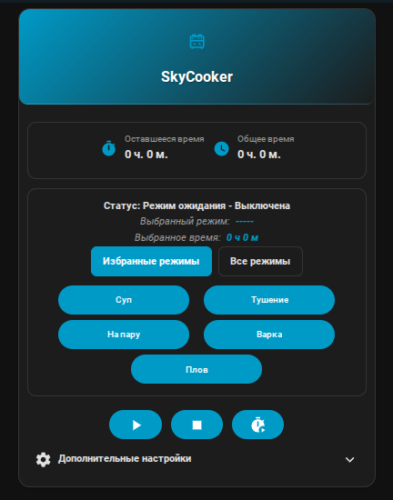
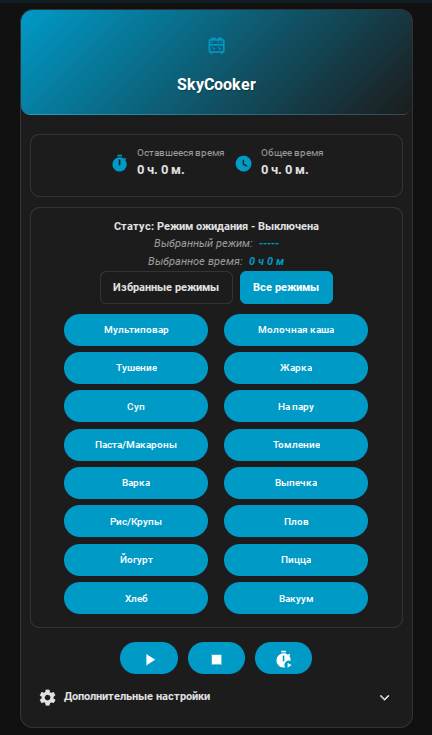
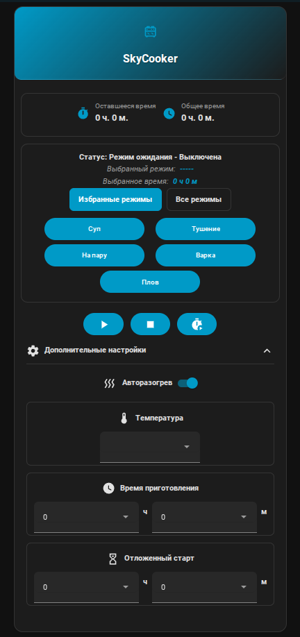

# SkyCooker Card

**Карточка для управления мультиваркой SkyCooker в Home Assistant**

## Ссылки

- [Репозиторий карточки](https://github.com/kai-zer-ru/skycooker-ha-card)
- [Интеграция SkyCooker для Home Assistant](https://github.com/kai-zer-ru/skycooker-ha)

## Описание

Эта карточка предоставляет удобный интерфейс для управления мультиваркой [SkyCooker](https://github.com/kai-zer-ru/skycooker-ha) через Home Assistant. Карточка имеет компактный дизайн, вдохновленный lovelace-mushroom, и поддерживает все функции мультиварки, включая управление режимами, временем приготовления, отложенным стартом, автоподогревом и температурой.

## Возможности

### Управление режимами работы
Карточка позволяет выбирать основные и дополнительные режимы приготовления. Доступные режимы включают:
- Мультиповар
- Выпечка
- Гриль
- Пароварка
- Жарка
- Тушение
- Разогрев
- Йогурт
- Молочная каша
- Каша
- Суп
- Жарка на воздухе
- Ферментация
- Пастеризация
- Сушка

### Управление временем приготовления
Позволяет устанавливать время приготовления в часах и минутах. Время отображается в формате ЧЧ:ММ и может быть изменено с помощью выпадающих списков.

### Отложенный старт
Позволяет настроить время отложенного старта приготовления. Время отложенного старта устанавливается в часах и минутах и отображается в интерфейсе.

### Автоподогрев
Функция автоподогрева позволяет поддерживать температуру блюда после завершения приготовления. Включается и отключается с помощью переключателя.

### Контроль температуры
Карточка поддерживает отображение и установку температуры приготовления. Температура может быть установлена с помощью сущности `cooking_temperature_entity`, что позволяет точно настроить процесс приготовления.

### Контроль состояния
Компактный блок состояния показывает ключевые параметры устройства, когда мультиварка включена (не в режиме «Выключена» / «Off»). Отображает текущую температуру, оставшееся и общее время, статус приготовления и при необходимости — диагностику.

Возможные значения статуса (RU / EN):
- Разогрев / Warming
- Готовка / Cooking
- Подогрев / Auto Warm
- Отложенный старт / Delayed Launch
- Ожидание / Waiting
- Ожидание загрузки продуктов / Waiting for ingredients

Для активных статусов (включая «Ожидание загрузки продуктов») показываются температура и таймеры, если соответствующие сущности настроены.

### Диагностика устройства
При наличии сущностей из интеграции SkyCooker в блоке состояния могут отображаться:
- **Процент успешных команд** (`success_rate_entity`) — надёжность связи с устройством
- **Код ошибки** (`error_code_entity`) — код последней ошибки (скрывается, если `0`)
- **Звук** (`sound_enabled_entity`) — включён ли звук на мультиварке

### Многоязычный интерфейс
Карточка поддерживает русский и английский языки. Язык интерфейса автоматически определяется из настроек Home Assistant.

### Два варианта оформления
Карточка поддерживает **классический** и **новый** дизайн. Переключение — параметром `new_design` в YAML или галочкой **«Новый дизайн»** в визуальном редакторе (раздел «Сущности»).

| | Классический (`new_design: false`, по умолчанию) | Новый (`new_design: true`) |
|---|---|---|
| Заголовок | Центрированный блок в рамке | Горизонтальная строка: иконка, название, индикатор статуса |
| Метрики | Отдельные блоки с рамками | Компактная сетка с мягким фоном |
| Программа и время | Текст по центру | Две карточки в ряд |
| Кнопки Старт/Стоп | Крупные, по центру | На всю ширину в сетке 2×1 |
| Доп. настройки | Блок в рамке | Плоский аккордеон с разделителем |

Для существующих карточек поведение не меняется: без `new_design` используется классический вид.

### Избранные режимы
Поддержка сущности `favorite_modes_entity` для отображения избранных режимов. Если эта сущность настроена, в интерфейсе появляются вкладки для переключения между избранными и всеми режимами. Это позволяет пользователю быстро выбирать часто используемые режимы.

### Дополнительные функции
- **Сенсоры времени**: отображение времени отложенного старта и автоподогрева
- **Подписи в селектах**: улучшенная доступность и понятность интерфейса
- **Красивые селекты времени**: закругленные углы, компактный размер, тени и плавные переходы для всех селектов
- **Сервисы интеграции**: кнопки «Старт» и «Стоп» вызывают `skycooker.start_cooking` и `skycooker.stop_cooking` с учётом отложенного старта

## Визуальный редактор

В редакторе карточки (раздел **Сущности**):

1. **Экземпляр SkyCooker** — выбор устройства из реестра Home Assistant; после выбора сущности заполняются автоматически.
2. **Автозаполнить по устройству** — подставляет все известные сущности интеграции по `device_id` (с запасным поиском по префиксу `object_id`).
3. **Новый дизайн** — переключатель оформления карточки.
4. Списки сущностей фильтруются по шаблону `skycooker_*`; выпадающие списки используют элементы `ha-dropdown-item`.

## Требования

- **Home Assistant 2026.6 или новее**
- Установленная [интеграция SkyCooker](https://github.com/kai-zer-ru/skycooker-ha) (те же требования к версии HA)

## Установка

### Через HACS (рекомендуется)

1. Добавьте этот репозиторий в HACS:
   - Перейдите в HACS > Интеграции
   - Нажмите на три точки в правом верхнем углу
   - Выберите "Пользовательские репозитории"
   - Добавьте [kai-zer-ru/skycooker-ha-card](https://github.com/kai-zer-ru/skycooker-ha-card) как репозиторий типа "Lovelace"
   - Нажмите "Добавить"

2. Установите карточку:
   - Перейдите в HACS > Frontend
   - Найдите "SkyCooker Card" и нажмите "Установить"

### Вручную

1. Скачайте [последний релиз](https://github.com/kai-zer-ru/skycooker-ha-card/releases/latest) с GitHub
2. Скопируйте файл `skycooker-ha-card.js` из папки `dist` в директорию `www` вашего Home Assistant
3. Добавьте карточку в ваши ресурсы:
   ```yaml
   resources:
     - url: /local/skycooker-ha-card.js
       type: module
   ```

## Конфигурация

Минимальная конфигурация карточки:

```yaml
type: custom:skycooker-ha-card
name: SkyCooker
icon: mdi:stove
language: ru
```

Полная конфигурация с всеми параметрами:

```yaml
type: custom:skycooker-ha-card
name: SkyCooker
icon: mdi:stove
language: ru
new_design: false
mode_entity: select.skycooker_mode
additional_mode_entity: select.skycooker_additional_mode
cooking_time_hours_entity: select.skycooker_cooking_time_hours
cooking_time_minutes_entity: select.skycooker_cooking_time_minutes
delayed_start_hours_entity: select.skycooker_delayed_start_hours
delayed_start_minutes_entity: select.skycooker_delayed_start_minutes
auto_warm_entity: switch.skycooker_auto_warm
start_entity: button.skycooker_start
stop_entity: button.skycooker_stop
start_delayed_entity: button.skycooker_start_delayed
temperature_entity: sensor.skycooker_temperature
cooking_temperature_entity: select.skycooker_cooking_temperature
remaining_time_entity: sensor.skycooker_remaining_time
cooking_time_entity: sensor.skycooker_cooking_time
status_entity: sensor.skycooker_status
success_rate_entity: sensor.skycooker_success_rate
error_code_entity: sensor.skycooker_error_code
sound_enabled_entity: sensor.skycooker_sound_enabled
current_mode_entity: sensor.skycooker_current_mode
current_additional_mode_entity: sensor.skycooker_current_additional_mode
auto_warm_time_entity: sensor.skycooker_auto_warm_time
delayed_launch_time_entity: sensor.skycooker_delayed_launch_time
favorite_modes_entity: select.skycooker_favorite_modes
```

## Параметры конфигурации

| Параметр | Тип | Обязательно | Описание |
|----------|-----|-------------|-----------|
| type | string | Да | Тип карточки: `custom:skycooker-ha-card` |
| name | string | Нет | Имя карточки (по умолчанию: "SkyCooker") |
| icon | string | Нет | Иконка карточки (по умолчанию: "mdi:stove") |
| language | string | Нет | Язык интерфейса (по умолчанию: "ru") |
| new_design | boolean | Нет | Включить новый дизайн карточки. `true` — компактный современный интерфейс; `false` или не указан — классический вид (по умолчанию: `false`) |
| mode_entity | string | Нет | Сущность для выбора режима работы. Отвечает за основные режимы приготовления, такие как "Мультиповар", "Выпечка", "Гриль" и другие. |
| additional_mode_entity | string | Нет | Сущность для выбора дополнительного режима. Используется для дополнительных настроек режима приготовления. |
| cooking_time_hours_entity | string | Нет | Сущность для выбора часов времени приготовления. Позволяет установить количество часов для приготовления. |
| cooking_time_minutes_entity | string | Нет | Сущность для выбора минут времени приготовления. Позволяет установить количество минут для приготовления. |
| delayed_start_hours_entity | string | Нет | Сущность для выбора часов отложенного старта. Позволяет установить количество часов для отложенного старта. |
| delayed_start_minutes_entity | string | Нет | Сущность для выбора минут отложенного старта. Позволяет установить количество минут для отложенного старта. |
| auto_warm_entity | string | Нет | Сущность для управления автоподогревом. Включает или отключает функцию автоподогрева после завершения приготовления. |
| start_entity | string | Нет | Сущность для кнопки старта. Запускает процесс приготовления с текущими настройками. |
| stop_entity | string | Нет | Сущность для кнопки остановки. Останавливает процесс приготовления и сбрасывает текущий режим. |
| start_delayed_entity | string | Нет | Сущность для кнопки отложенного старта. Запускает процесс приготовления с задержкой, установленной в `delayed_start_hours_entity` и `delayed_start_minutes_entity`. |
| temperature_entity | string | Нет | Сущность для отображения текущей температуры. Показывает текущую температуру внутри мультиварки. |
| cooking_temperature_entity | string | Нет | Сущность для выбора температуры приготовления. Позволяет установить желаемую температуру для приготовления. Эта сущность используется для точной настройки температуры в режимах, где это возможно. |
| remaining_time_entity | string | Нет | Сущность для отображения оставшегося времени приготовления. Показывает, сколько времени осталось до завершения процесса. |
| cooking_time_entity | string | Нет | Сущность для отображения общего времени приготовления. Показывает общее время, установленное для приготовления. |
| status_entity | string | Нет | Сущность текущего статуса мультиварки (см. список значений в разделе «Контроль состояния»). |
| success_rate_entity | string | Нет | Сенсор процента успешных команд (`success_rate`). |
| error_code_entity | string | Нет | Сенсор кода ошибки устройства (`error_code`). |
| sound_enabled_entity | string | Нет | Сенсор состояния звука мультиварки (`sound_enabled`). |
| current_mode_entity | string | Нет | Сущность для отображения текущего режима приготовления. Показывает, какой режим в данный момент активен. |
| current_additional_mode_entity | string | Нет | Сущность для отображения текущего дополнительного режима. Показывает дополнительные настройки текущего режима. |
| auto_warm_time_entity | string | Нет | Сущность для отображения времени автоподогрева. Показывает, сколько времени осталось до завершения автоподогрева. |
| delayed_launch_time_entity | string | Нет | Сущность для отображения времени отложенного старта. Показывает, сколько времени осталось до начала отложенного старта. |
| favorite_modes_entity | string | Нет | Сущность для отображения избранных режимов. Позволяет пользователю быстро выбирать часто используемые режимы. Если эта сущность настроена, в интерфейсе появляются вкладки для переключения между избранными и всеми режимами. |

## Примеры использования

### Минимальная конфигурация

```yaml
type: custom:skycooker-ha-card
name: Моя мультиварка
icon: mdi:pot-mixer
language: ru
mode_entity: select.skycooker_mode
start_entity: button.skycooker_start
stop_entity: button.skycooker_stop
temperature_entity: sensor.skycooker_temperature
```

### Новый дизайн

```yaml
type: custom:skycooker-ha-card
name: SkyCooker
icon: mdi:stove
language: ru
new_design: true
mode_entity: select.skycooker_mode
start_entity: button.skycooker_start
stop_entity: button.skycooker_stop
status_entity: sensor.skycooker_status
favorite_modes_entity: select.skycooker_favorite_modes
```

В редакторе карточки: раздел **Сущности** → включить **«Новый дизайн»**.

### Полная конфигурация

```yaml
type: custom:skycooker-ha-card
name: SkyCooker Pro
icon: mdi:stove
new_design: false
temperature_entity: sensor.skycooker_temperature
remaining_time_entity: sensor.skycooker_remaining_time
cooking_time_entity: sensor.skycooker_cooking_time
status_entity: sensor.skycooker_status
success_rate_entity: sensor.skycooker_success_rate
error_code_entity: sensor.skycooker_error_code
sound_enabled_entity: sensor.skycooker_sound_enabled
current_mode_entity: sensor.skycooker_current_mode
mode_entity: select.skycooker_mode
additional_mode_entity: select.skycooker_additional_mode
cooking_time_hours_entity: select.skycooker_cooking_time_hours
cooking_time_minutes_entity: select.skycooker_cooking_time_minutes
delayed_start_hours_entity: select.skycooker_delayed_start_hours
delayed_start_minutes_entity: select.skycooker_delayed_start_minutes
auto_warm_entity: switch.skycooker_auto_warm
start_entity: button.skycooker_start
stop_entity: button.skycooker_stop
start_delayed_entity: button.skycooker_start_delayed
cooking_temperature_entity: select.skycooker_cooking_temperature
auto_warm_time_entity: sensor.skycooker_auto_warm_time
delayed_launch_time_entity: sensor.skycooker_delayed_launch_time
favorite_modes_entity: select.skycooker_favorite_modes
```

## Внешний вид

### Классический дизайн (по умолчанию)

Блочный интерфейс с рамками вокруг секций, центрированным заголовком и крупными кнопками действий. Подходит, если нужен привычный «панельный» вид.

### Новый дизайн (`new_design: true`)

Более плоский и компактный интерфейс без лишних рамок:

- **Заголовок в одну строку** — иконка, название, статус и индикатор
- **Метрики в сетке** — температура, таймеры и прочие показатели в компактных ячейках
- **Выбранная программа и время** — в двух карточках рядом
- **Кнопки на всю ширину** — Старт и Стоп в одной строке
- **Дополнительные настройки** — аккордеон с выравниванием подписей и полей

Оба варианта используют одни и те же сущности и функции; меняется только оформление.

## Скриншоты

### Классический внешний вид (избранные режимы)


*Интерфейс с вкладкой "Избранные режимы", где отображаются только часто используемые режимы.*

### Классический внешний вид (все режимы)


*Интерфейс с вкладкой "Все режимы", где отображаются все доступные режимы приготовления.*

### Расширенный внешний вид


*Расширенный интерфейс с дополнительными настройками, такими как температура, время приготовления и отложенный старт.*

## Устранение неполадок

### Карточка не отображается

1. Проверьте, что файл `skycooker-ha-card.js` находится в правильной директории
2. Убедитесь, что ресурс добавлен в конфигурацию Home Assistant
3. Проверьте, что тип карточки указан правильно: `custom:skycooker-ha-card`
4. Очистите кэш браузера и перезагрузите страницу

### Карточка отображается, но не работает

1. Проверьте, что все указанные сущности существуют в вашей системе Home Assistant
2. Убедитесь, что имена сущностей написаны правильно
3. Проверьте, что сущности доступны и имеют правильные состояния
4. Проверьте логи браузера на наличие ошибок (F12 > Console)

### Сообщение "Не настроено"

Это сообщение появляется, если ни одна сущность не указана в конфигурации. Добавьте хотя бы одну сущность для отображения состояния.

### Проблемы с выбором программ

Если программы не выбираются или не отображаются:

1. Убедитесь, что `mode_entity` и `favorite_modes_entity` (если используется) указаны верно.
2. Проверьте, что у select-сущностей в атрибутах есть список опций (`options`, `values` и т.п.).
3. Откройте консоль браузера (F12 → Console) и проверьте ошибки JavaScript.
4. В редакторе карточки используйте **Экземпляр SkyCooker** или **Автозаполнить по устройству**, чтобы подставить корректные entity_id.

### Карточка не реагирует на «Старт» / «Стоп»

Кнопки вызывают сервисы интеграции `skycooker.start_cooking` и `skycooker.stop_cooking`. Убедитесь, что интеграция [SkyCooker](https://github.com/kai-zer-ru/skycooker-ha) установлена и сущности `start_entity` / `stop_entity` относятся к вашему устройству.

## Разработка

### Требования

- Node.js 18.18 или выше (см. `.nvmrc`)
- npm или yarn

### Установка зависимостей

```bash
npm install
```

### Сборка и проверки

```bash
npm run build          # только сборка
make ci                # lint, typecheck, build (как в CI)
make version vX.Y.Z    # синхронизировать VERSION, package.json, CARD_VERSION
make tag-release       # сборка, git-тег vX.Y.Z и push (чистое дерево)
```

Локальный прогон GitHub Actions (нужен [act](https://github.com/nektos/act)):

```bash
make act-push          # workflow ci.yml
make act-release       # workflow release.yml (нужен GITHUB_TOKEN)
```

### Разработка с автоматической перезагрузкой

```bash
npm run dev
```

### Структура проекта

- `src/skycooker-ha-card.ts` — основной файл карточки
- `src/skycooker-ha-card-editor.ts` — редактор конфигурации
- `src/components/` — UI-компоненты (заголовок, статус, кнопки, селектор программ, доп. настройки)
- `src/config.ts`, `src/entity-utils.ts`, `src/status-utils.ts` — конфигурация и утилиты
- `src/localize.ts` — локализация
- `src/const.ts` — константы (версия карточки)
- `src/translations/` — файлы переводов
- `dist/skycooker-ha-card.js` — собранный файл (результат)
- `Makefile`, `.github/workflows/` — CI и релиз

## Локализация

Карточка поддерживает несколько языков и автоматически определяет язык интерфейса из настроек Home Assistant.

### Поддерживаемые языки

- Русский (ru) - основной язык
- Английский (en)

### Добавление нового языка

1. Создайте новый файл JSON в `src/translations/` (например, `de.json` для немецкого)
2. Скопируйте структуру из `en.json` и переведите все значения
3. Добавьте новый язык в `src/localize.ts`
4. Соберите проект: `npm run build`

## Лицензия

Этот проект лицензирован под лицензией MIT. Подробности смотрите в файле LICENSE.
